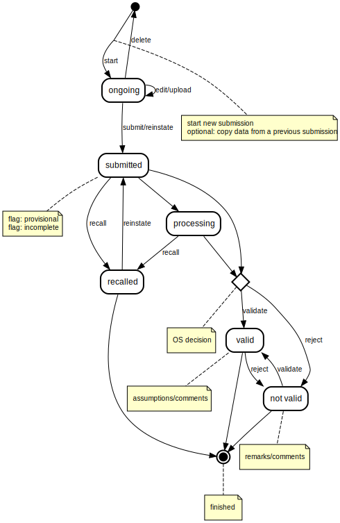

# Overview of the *Data Submission* process

The description below covers all possible states during the submission process, together with entry conditions, possible transitions and remarks:

## Versioning of submissions

The ORS shall implement versioning of reported data, meaning that whenever a set of data is submitted, a copy of it is kept in the archive. We will refer to these copies as _submissions_ and the term should be understood as a version of the reported data at a particular point in time.

Each submission can be viewed and manipulated independently.

Intermediary changes to a submission will be audited, but full copies of the data will not be kept while the submission remains in the same state of the workflow.

A submission is always linked to a single:

- party
- reporting period
- and reporting obligation

## Access rights

In general, a submission is only visible to _reporter_ users from the corresponding Party, to the _Secretariat_ users and to the _Administrators_.
Reporters belonging to another Party are not allowed to see other's data.

## Attributes (flags) of submissions

During the data entry step and before submitting, several flags (checkboxes) are available to the reporter.

### Provisional flag
The _provisional_ flag can be set or removed by the reporter while a Submission is ongoing.
It signals that future changes (updated submissions for the same reporting period) are foreseen.
A provisional submission is processed by the Ozone Secretariat like any other submission.

TODO EDW: It is likely that some additional reminders/notifications are going to be sent to the reporter at certain times during the reporting cycle (e.g. close to deadlines).
TODO Gerald: to think and agree on more details about these notifications.

### Incomplete flag
The _incomplete_ flag can be set or removed by the reporter while a Submission is ongoing.
It signals that some data is not included in the submission and that the reporter is aware.

The flag can be set also automatically by the ORS, but only after getting the reporter's confirmation.

TODO Gerald: how granular should it be? per-submission, per data form or per-substance?

## Creating a submission

- _Reporters_ can create a new empty submission or can copy data from a previous submission, as follows:

  - from _the final_ (latest _Valid_) submission of any previous period - **if** no submission exists for the currently selected period. *By default*, the interface will show the most recent period which is smaller than the selected reporting period.
  - from any other intermediary submission (within the current period), but not ones for previous periods - **if** submissions for the current period already exist. *By default*, the interface will show most recent submission from current period. Copying _Valid_, _Not valid_ and _Recalled_ submissions shall be possible.

- _Secretariat_ users can also impersonate reporters and create new submissions on their behalf (e.g. when data is received via email).

TODO Gerald: should any special flag be set in such cases (when the secretariats reports on behalf of users)?

The initial state of a new submission is _Ongoing_.

## List of workflow states

- [Ongoing](#1-ongoing)
- [Submitted](#2-submitted)
- [Recalled](#3-recalled)
- [Processing](#4-processing)
- [Valid](#5-valid)
- [Not valid](#6-not-valid)

## State diagram

The diagram below has been generated using https://state-machine-cat.js.org and the source code from [this file](workflow.src).

## 1. ONGOING

This represents the initial state in which data entry by a reporter has been initiated, but is still in progress and has not yet been submitted.

At any given time, there is only one _ongoing_ submission per Party and per reporting period.
However, there can be multiple _ongoing_ submissions at the same time for a given Party (for different reporting periods).

### Entry and exit

A submission can enter the _Ongoing_ state only when it is created and remains _ongoing_ until the reporter initiates the _submit_ action.

From the _Ongoing_ state, the state of the submission can change to:

- _Submitted_, at the request of the reporter (or the Secretariat acting on behalf of the reporter)

### Actions by role

#### Reporter

While a submission is ongoing, _reporter_ users (from the corresponding Party) will be able to:

- make changes to the data using the web forms
- upload data in the form of an xls or xlsx file
- delete the submission
- _submit_, which triggers the transition to _Submitted_ and sends a notification to all users holding the Secretariat role

TODO Gerald: should notifications be sent also to other (all) reporters from the same party?

TODO Gerald: should any colleague be able to submit or only the author?

#### Secretariat

_Secretariat_ users are able to view the submission details, but not make any changes.

TODO Gerald: validate that the Secretariat cannot make any changes unless they report on behalf of the Party (fully)
TODO Gerald: maybe a better option is to prevent changes unless the submission was created by a Secretariat user?.

## 2. SUBMITTED

In this state, data has been officially submitted by the reporter and is awaiting action from the Ozone Secretariat.

### Entry and exit

Submission which are _Ongoing_ or _Recalled_ can enter the _Submitted_ state.
From the _Submitted_ state, the state of the submission can change to:

- _Processing_: The Secretariat can change the state to Processing, so that parties know their data is being processed;
- _Valid_ or _Not valid_, at the Secretariat's request, as a shortcut (skipping the _Processing_ state);
- _Recalled_: A reporter may choose to recall a specific submission if its data is deemed incorrect, signalling to the Ozone Secretariat that the Party shall revise the data.

### Actions by role

#### Reporter

Once submitted, data cannot be edited anymore by reporters. However, a different submission may be created after _recalling_ the existing submission and optionally copying data from it.

#### Secretariat

The Secretariat can set the next state of the submission to either _Valid_ or _Not valid_, depending on their findings.

TODO EDW: link to the section where business rules and validation are described.

TODO Gerald: Anything else that the secretariat can do while a submission is Submitted?

## 3. RECALLED

This state signifies that the reporter considers this submission incorrect or incomplete. The submission is basically "frozen" (it does not return to to _Ongoing_ state and data is not physically erased, but rather archived for historical and audit purposes).

As explained above, data in a recalled submission can be copied (and then modified) to create a new submission.

### Entry and exit

Submissions which are _Submitted_ or _Processing_ can enter the _Recalled_ state.
From the _Recalled_ state, the state of the submission can change to:

- _Submitted_: A recalled submission can be _re-instated_ by the reporter, thus changing back its state back to Submitted.

TODO Gerald: When re-instating a submission, should the ORS allow changes to the data or simply it means re-submitting the same data which was recalled?

### Actions by role

#### Reporter

A reporter can re-instate the submission or create a new Ongoing submission in case changes are necessary.

#### Secretariat

Secretariat users can only view a recalled submission.

TODO Gerald: Should you be able to insert comments/remarks, etc? If so, at which stages and how granular?

## 4. PROCESSING

At this point, the Ozone Secretariat is doing the processing of the reported data and the reporter knows their data is being processed.

### Entry and exit

Only submissions which are _Submitted_ can enter the _Processing_ state.
From _Processing_, the state of the submission can change to:

- _Recalled_, at the reporter's request, or
- either one of _Valid_ or _Not valid_, based the Secretariat's decision.

### Actions by role

Reporters can _Recall_ the submission.
Secretariat users can _Validate_ or _Invalidate_ the submission.

TODO EDW: link to the section where business rules are described.

## 5. VALID

At this point, the Ozone Secretariat considers that the data is correct and potentially final (unless the provisional flag is set).

Such a submission is considered correct by the Ozone Secretariat - with possible assumptions and comments. 

TODO Gerald: More details about *commenting* (adding remarks or further instructions) feature.

It is up to the *Party* to create a new submission, copy the data, make changes and submit it, in case any of the OS's comments require action.

### Entry and exit

Submission found in _Submitted_, _Processing_ and _Not valid_ states can enter the _Valid_ state.
Although _Valid_ is a final state, the Ozone Secretariat will be allowed to reconsider their initial decision and change the state to _Not valid_ when necessary (e.g. in case of a mistake) and viceversa.

### Actions by role

Reporters can only view the submission, but are allowed to create a new one in case revisioning the data is necessary.

The secretariat can invalidate a valid submission.

## 6. NOT VALID

At this point, the Ozone Secretariat considers that the data is incorrect and requires changes.
To correct the errors, the reporter is required to create a new submission, which can be based on the rejected data (with the necessary modifications).

Rejected submissions can be copied to create a new _Ongoing_ submission, but the final state of the original submission will remain _Not valid_ and a copy of the data will be kept in the ORS.

### Entry and exit

Submission found in _Submitted_, _Processing_ and _Valid_ states can enter the _Not valid_ state.
Although _Not valid_ is a final state, the Ozone Secretariat will be allowed to reconsider their initial decision and change the state to _Valid_ when necessary (e.g. in case of a mistake) and viceversa.

### Actions by role

Reporters can only view the submission, but are allowed to create a new one in case revisioning the data is necessary.

The secretariat can validate a _Not valid_ submission.
