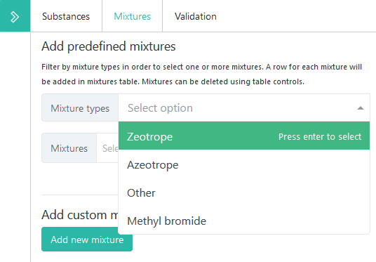
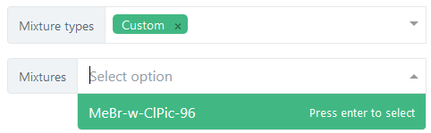

.. _Article7:

################################
Article 7 - Data reporting forms
################################

.. index:: Article 7 data reporting

The Article 7 data reporting forms have nine main sections. :guilabel:`Submission Info` and :guilabel:`Files` are explained in the general :ref:`Data entry forms` chapter. The rest of the tabs are described below.

.. hint::
  Each form has its own detailed instructions on data reporting, displayed when clicking on the |icon-info| icon in the upper-left area of the page.

.. |icon-info| image:: images/icon-info.png

The questionnaire
=================

.. index:: Questionnaire

In the :guilabel:`Questionnaire` tab you must answer a set of six questions, each corresponding to one of the remaining tabs of the Article 7 form: :guilabel:`Imports`, :guilabel:`Exports`, :guilabel:`Production`, :guilabel:`Destruction`, :guilabel:`Non-party`, :guilabel:`Emissions`.
Each tab will be automatically enabled once the corresponding question is answered.

You are allowed to :guilabel:`Save and continue` before choosing `Yes` or `No` for all questions, but you must fill-in the entire questionnaire before submitting.

.. caution::
  For compatibility reasons, the system still allows you to add substances when choosing `No` in the questionnaire.
  However, you should not do that, because those amounts will not be saved in the form. This is also mentioned in a visible warning in the corresponding tab.

The `Questionnaire` tab includes a :guilabel:`Comments (Party)` field where you can enter general remarks about the submission.
There are similar fields for all the other tabs, where more specific remarks can be entered.

Imports and Exports
===================

.. index:: Imports, Exports

The `Imports` and `Exports` tabs are similar in layout and structure. After adding a substance (see :ref:`Adding substances`), you can either:

- select one or more countries/regions/territories, in case you are able to report amounts differentiated by importing/exporting party
- proceed directly to entering amounts in metric tonnes for all importing/exporting parties together.

To select importing/exporting parties, first add one or more substances or blends in the main table as described in :ref:`Adding substances`/`Adding blends`_,
then click on the |icon-countries| multiple select widget and pick one or more values from the list:

.. |icon-countries| image:: images/form_input_countries.png
.. image:: images/form_select_party.png

You can filter the list by typing and select countries by pressing :kbd:`Enter` (or left mouse button). 
Once the selection of parties is finished, press the :guilabel:`Add # rows` button to add rows in the table.
In case of incorrect selection of countries, you can still make changes to the row by pressing the |icon-edit| Edit button 
or completely remove a row using the |icon-delete-small| button.
Both buttons are located on the far-right end of each row.
Deleting multiple rows is possible, by first |icon-check| checking the first column, then pressing the :guilabel:`Delete # selected rows` button, 
which appears after selecting one or more rows.

.. |icon-edit| image:: images/icon-edit.png
.. |icon-delete-small| image:: images/icon-delete-small.png
.. |icon-check| image:: images/icon-check.png

.. index:: Exemptions

Furthermore, you can enter amounts, as follows:

- the total quantity imported/exported for all uses, by entering a value in column :guilabel:`New`, :guilabel:`Recovered and reclaimed`, or both;
- the import/export for feedstock, by entering a value directly in the :guilabel:`Feedstock` column;
- the amounts of imported/exported for exempted essential, critical, high-ambient-temperature or other uses, by clicking on the corresponding column: |form_input_exempted|.

.. |form_input_exempted| image:: images/form_input_exempted.png

This action will open a modal dialog where individual amounts and remarks for each type of exempted use can be entered: |form_exempted|

.. |form_exempted| image:: images/form_exempted.png

Using this screen you could alternatively change the selected substance, change the importing/exporting party or enter specific remarks applicable to the current row.
The modal dialog can be closed by pressing :kbd:`Esc` or the :guilabel:`Close button`.

.. index:: QPS, Quarantine and pre-shipment, Polyols

In addition to the exempted amounts, some substances allow entering additional amounts, such as:

- the amount of Methyl Bromide imported/exported for quarantine and pre-shipment applications: |form_input_qps|
- the amounts contained in pre-blended polyols: |form_input_polyols|

.. |form_input_qps| image:: images/form_input_qps.png
.. |form_input_polyols| image:: images/form_input_polyols.png

.. hint::
  All decimal amounts should be entered using the `.` (dot) decimal separator, regardless of your regional computer settings.

.. note::
  It is not mandatory to enter the total quantity imported/exported for all uses (new or recovered and reclaimed) in case you want to report the amount of imported/exported feedstock uses for all parties (without selecting any country), while reporting individual total quantities for each party.
  The same goes for the exempted amounts, for the Methyl Bromide amount imported/exported for QPS applications and for the amounts contained in pre-blended polyols.

.. caution::
  The total quantity imported/exported for all uses should be equal or higher than the sum of feedstock, exempted uses, QPS amounts, etc.
  Otherwise, an error message will be shown in the :guilabel:`Validation` tab (see :ref:`Data validation` chapter for more details)

.. _Adding blends:

Adding blends (mixtures)
========================

.. index:: Blends, Mixtures

Four of the Article 7 data submission forms allow entering mixtures (blends): :guilabel:`Imports`, :guilabel:`Exports`, :guilabel:`Destruction` and :guilabel:`Non-party`.

Standard mixtures
^^^^^^^^^^^^^^^^^

All standard mixtures (as listed in section 11) are defined in the reporting system and they can be selected from the :guilabel:`Blends` tab, in the right sidebar, near the :guilabel:`Substances` add form. It is possible to filter blends by type (`Azeotrope`, `Zeotrope`, etc.):

It is possible to select one or more blends from the list and add the to the second table in the main form. While selecting blends, their composition is displayed:

.. image:: images/form_blends_composition.png

When added in the main table, blends behave similar to substances. It is possible to click on the second column (blend name) to view the amounts broken down by blend components:

Non-standard mixtures
^^^^^^^^^^^^^^^^^^^^^

.. index:: Non-standard mixtures

To report amounts for a mixture which is not defined in the system, use the :guilabel:`Add new blend` function.
To do so, enter a suggestive name for the new blend in the :guilabel:`Blend name` field, pick the substances from the select lists and enter the percentages for each substance in the :guilabel:`%` input field:

If your mixture has less than three components, you will have to remove the last empty row by pressing the |icon-delete-alt| delete icon.
Press the :guilabel:`Add row` button to add the custom blend in the form, or the :guilabel:`Cancel` button to start over.

.. |icon-delete-alt| image:: images/icon-delete-alt.png

Once created, a non-standard mixture can be reused in other forms or submissions, under the ``Custom`` blend type:

.. hint::
  It is recommended that you save often, to prevent data loss in case of connectivity issues.
  You should ideally save the submission after the completion of each tab/form.

Production
===============

.. index:: Production

The production tab is similar to the :guilabel:`Imports` and :guilabel:`Exports` tabs, except for:

- the form does not include an exporting/destionation party column;
- blends cannot be added in the `Production` table;
- there is an additional column called :guilabel:`Production for BDN for A5 parties`, to report production for supply to Article 5 countries in accordance with articles 2A, 2H and 5;
- HFC-23 amounts are grouped under a dedicated table, having a slightly different structure. Please note the `Captured` labels (instead of `Produced`) for all uses and for feedstock uses. There is also an additional column :guilabel:`Captured for destruction`:

.. image:: images/form_production_hfc23.png

Destruction
===============

.. index:: Destruction

The :guilabel:`Destruction` tab allows adding both substances and blends, together with the amount destroyed. 
As this table has less columns, the remarks can be entered directly in the column.

Non-party trade
===============

.. index:: Non-party trade

The :guilabel:`Non-party` tab allows to report imports from and/or exports to non-parties.
Please check the |icon-info| detailed instructions to see what non party means for the purpose of this data form.

For each substance or blend you can optionally (on a voluntary basis) mention the Exporting/destination party.
Please note that the list of countries/regions/territories depends on the reporting period and the selected substance.
Regions and territories associated with parties are always included in the list.

Please also note that HFC's cannot be selected in the trade with non-parties form until 2033, according to article IV para 2 of the Kigali Amendment.

.. hint::
  When there are both imports and exports with a non-party to be reported for the same substance/blend, please add only one row in the table,
  select the exporting/destination country and fill-in both `Quantity of imports` and `Quantity of exports` columns.

Emissions
=========

.. index:: Emissions

The :guilabel:`Emissions` tab is different from the other tabs. Instead of the :guilabel:`Add substances` button there is a :guilabel:`Add facility` button,
which simply adds an empty row in the `Facilities` table.

It is mandatory to fill-in at least the :guilabel:`Facility name or identifier` and the :guilabel:`Amount of generated emissions` columns.
Please read carefully the available |icon-tooltip| tooltips and the overall |icon-info| detailed instructions.

.. |icon-tooltip| image:: images/icon-tooltip.png

Reporing amounts for columns 2-5 are optional, but in case you decide to enter them, the total amount generated (2) must be greater or equal to 
the amount generated and captured for all uses (3a). added with amouont used for feedstock (4), amount destroyed (5) and amount of generated emissions (6).

The submission workflow for Article 7 data reporting
====================================================

.. _Submit:

.. index:: Submit (Art7)

:guilabel:`Submit`
  Once the data entry phase is done and there are no validation |icon-caution| errors, you can `Submit` your report for processing by the Secretariat.

  You will be asked to confirm the submission. Please review carefully the messages in the popup dialog, as they may contain relevant information, 
  depending on the entered data:

  .. image:: images/form_submit_confirm.png

  After submitting, you will only be able to change the reported data by using the :ref:`Recall <Recall>` or :ref:`Revise <Revise>` functions.

.. |icon-caution| image:: images/icon-caution.png

.. _Recall:

.. index:: Recall, Revoke, Superseded

:guilabel:`Recall`
  Is only available when a form has already been submitted.
  It will mark inform the secretariat that the submitted data must be no longer considered valid  and a new submission may follow.
  A recall action can be undone by using the `Reinstate`_ action.

.. note::
  In case another prior submission for the same period exists (before the one being recalled), that submission will become the `current` one.

.. _Reinstate:

.. index:: Reinstate, Superseded

:guilabel:`Reinstate`
  Is only available for `Recalled` submission and will restore that submission to its previous state (e.g. Submitted).

.. note::
  In case another current version existed for the same period, that version becomes `superseded` and the reinstated submission becomes the `current` one.

.. hint::
  Superseded versions can be identified in the :guilabel:`Submission status` section:

.. image:: images/form_superseded.png

When a submission has multiple versions, they can be viewed and opened using the :guilabel:`Versions` button in the action bar:

.. image:: images/form_versions.png

Other actions specific to Article 7 data reporting
====================================================

:guilabel:`Export as PDF`
  Any submission can be exported in PDF format for archiving or printing by pressing the :guilabel:`Export as PDF` button.
  This action is available before or after submitting a data report. It will always contain the information already saved on the server,
  so it is recommended to save the form before exporting the PDF document.

:guilabel:`Calculated amounts`
  This function allows you to preview the calculated production and consumption for all applicable annex groups.
  The table displayed includes baseline amounts, limits corresponding to the current reporting period and actual amounts
  for production, consumption and production allowance for basic domestic needs of Article 5 parties, where applicable.

  The table looks like in the image below and can also be exported to a PDF file by pressing the :guilabel:`Export PDF` button:

  .. image:: images/form_prodcons.png

.. index:: Versions

:guilabel:`Versions`

  The :guilabel:`Versions` button shows a table with all versions of a submission (for the same reporting obligation and reporting period),
  together with their metadata, such as author, last modification date and current state. An older version can be opened by pressing the 
  :guilabel:`View` button in the `Actions` column:

  .. image:: images/form_versions.png

  For more information, please see the explanations of the :ref:`Revise <Revise>` function.

