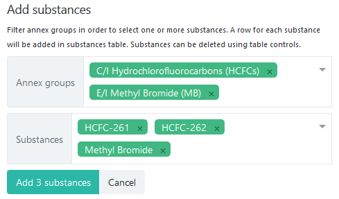

************
Features
************

.. _Dashboard:

The dashboard
=============

The dashboard contains three main sections:

Create submission
  | To create a new submission, you must select a ``Reporting obligation`` and a ``Reporting period``, then press the :guilabel:`Create` button.
  | The available reporting obligations designated by the Secretariat can be found in section `List of reporting obligations`_ below.
  | The current reporting period is selected by default and highlighted in orange: |2018|.

.. |2018| image:: images/2018.png
  :scale: 100%
  :align: middle

Data entry in progress
  The section on the top-right of the Dashboard shows the work in progress (i.e. not yet `Submitted`).
  You can resume work on the submission by pressing the :guilabel:`Edit` button.

All submissions
  The table in the lower area of the Dashboard contains all historical submissions.
  You can filter by reporting obligation and period by using the corresponding filters: :guilabel:`Obligation`, :guilabel:`From`, :guilabel:`To`. Filtering is done automatically, once a value is selected.
  To reset filtering, press the :guilabel:`Clear` button.
  The table is paginated, allowing you to navigate to the first/previous/next/last page and to increase the number of rows using the :guilabel:`Per page` option.

.. hint::
  By default, only the current submission for each obligation/period is shown in the table. To view `Superseded` versions, the :guilabel:`Show all versions` checkbox can be used.

.. _Data entry forms:

The data entry forms
====================

This section describes actions and entry forms elements which are common to all forms.

Submission info
---------------

All forms have a :guilabel:`Submission Info` tab: |subinfo|
This section is automatically filled by the system with data from the latest submission, when available.
You must fill-in at least the mandatory fields (``Name of reporting officer`` and ``E-mail``) before saving the submission.
The ``Reporting channel`` and ``Submission format`` fields are reserved for the Secretariat.

.. |subinfo| image:: images/form_submission_info.png

After a report is submitted, a new field becomes visible (read-only), automatically filled by the system with the actual 
date when the :guilabel:`Submit` action has been completed.

.. image:: images/form_date_of_submission.png

On the right side of the `Submission Info` tab there is a section which depends on the type of submission.
For Article 7 data reporting, this section contains ``Flags``, ``Annex groups reported in full`` and ``Submission status``:

.. image:: images/form_submission_info2.png

Flags
  The :guilabel:`Provisional` flag shall be used to inform the Secretariat that the reported data is not final and another report will be submitted.
  To submit another version of the data, you will have to use the `Revise`_ functionality.

Annex Groups reported in full
  This set of checkboxes are specific to :ref:`Article7`. You should check each of them when your submission contains all data about the corresponding annex group.

Submission status
  This box contains additional metadata of the submission: the current status (Data entry in progress, Submitted, Processing, Finalized, etc.), the version number, the original author, the creation date and the date of the last modification.

.. index:: Upload, Files, Attachments, Supporting documents

Files
------

All type of submission allow the upload of file attachments - from a predefined list of file types. In case the format of your attachment is not included in the list, please pack it in a zip archive or contact the secretariat.
The :guilabel:`File` tab initially contains only the :guilabel:`Browse` input and button:

.. image:: images/form_files_1.png

Pressing the :guilabel:`Browse` button allows you to select one or more files, which will be listed below:

.. image:: images/form_files_2.png

At this point you can add more files, enter an optional (plain text) description for each file or start the upload, 
by pressing the :guilabel:`Start upload` button or the :guilabel:`Save and continue` button in the lower section of the page. 
The attachments will be uploaded one by one and in case of network errors the process will be automatically resumed:

.. image:: images/form_files_3.png

When all files are uploaded, they will be displayed in the :guilabel:`Uploaded files` table below:

.. image:: images/form_files_4.png

You can add more files by repeating the procedure above. The new files will always be shown above of the already uploaded files:

.. image:: images/form_files_5.png

At any time you can |icon-delete| remove or |icon-download| download uploaded files.

.. |icon-delete| image:: images/icon-delete.png
.. |icon-download| image:: images/icon-download.png

.. caution::
  Before removing a file, a confirmation dialog will be shown. After pressing :guilabel:`Ok` in the confirmation dialog,
  the file is immediately deleted from the server, *without being necessary to press* the :guilabel:`Save and continue` button.

.. _Adding substances:

Adding substances
-----------------

To add new rows in any form, use the :guilabel:`Add substances` button found on the top-right side of the page 
(only available for submissions in `Data entry in progress` state):

It will open the ``Add substances`` panel, when you can optionally filter by :guilabel:`Annex groups` and/or :guilabel:`Substance names`

Both filters allow multiple values:

To finalize the selection, press the :guilabel:`Add (#) rows` button. To cancel the selection, press :guilabel:`Cancel`.
To hide the substance selection area, press the |icon-arrow| icon.

.. _Data validation:

Data validation
---------------

Near the :guilabel:`Substances` tab there is the :guilabel:`Validation` tab, where various warnings, depending on the form type, are shown:

.. image:: images/form_validation.png

Substance names are clickable, to allow easier identification of rows affected by validation problems.
When clicking the name of a substance, a filter is automatically applied to the corresponding table rows:

.. image:: images/form_validation2.png

All table rows affected by validation problems are marked with the |icon-caution| exclamation mark icon,
which is also clickable and opens the :guilabel:`Validation` tab, highlighting the corresponding error message.

.. |icon-caution| image:: images/icon-caution.png

Depending on the situation, data entry forms (tabs) may be decorated with various icons, as described below:

.. image:: images/form_legend.png

Common actions
--------------

An action toolbar is present in the lower area of all forms.
The buttons allow to save, delete, submit or close the data entry screen, plus specific actions depending on the form type.

:guilabel:`Save and continue`
  Performs validation of the entered data and stores the information on the server.

.. hint::
  Whenever a form has been modified and not yet saved, the corresponding tab will be decorated with the |icon-edit| icon.

.. |icon-edit| image:: images/icon-edit.png

:guilabel:`Close`
  Closes the form and navigates to the `Dashboard`. In case changes have been made and not yet saved, a confirmation dialog is displayed.

.. index:: Submit

:guilabel:`Submit`
  Is only available when a form has not yet been submitted. To make changes after submitting the form you will need to use the :ref:`Revise <Revise>` function,
  with the exception of some basic additions which are still allowed after submitting, such as adding comments and uploading new files.

.. index:: Delete

:guilabel:`Delete`
  Is only available when a form has not yet been submitted. It will completely remove all entered information, without the possibility to undo this operation!
  In case you need to delete Article 7 data which has already been submitted, you must use the :ref:`Recall <Recall>` function.

.. index:: Revise

.. _Revise:

:guilabel:`Revise`
  Is only available when a form has already been submitted.
  Using this button will create a new version of the submission (copying all data from the original submission).
  While the new version remains in `Data entry in progress` state, the original submission remains valid (is considered `current`).
  Once this new version is submitted, the previous one becomes obsolete (`Superseded`).

For more specific details of each form, see the detailed sections of each main reporting obligation:

.. toctree::
  :maxdepth: 2

  art7
  raf

.. index:: Calculated production, Calculated consumption

Calculated production and consumption
=====================================

.. warning:: TODO

.. index:: Lookup tables

Lookup tables
=============

.. warning:: TODO

.. index:: Reports

Reports
=======

.. warning:: TODO

.. _List of reporting obligations:

List of reporting obligations
=============================

- Article 7 - Data Reporting
    Description here

- Article 9 - Research, development, public awareness and exchange of information
    Summary of activities, reported every two years.

- Article 4B - Licensing information
    The establishment and operation of a licensing system, focal points for licensing systems for trade in controlled substances (Decision IX/8, paragraph 2), information on illegal trade in controlled substances (Decision XIV/7, paragraph 7) and parties wishing to avoid the unwanted import of products and equipment containing or relying on hydrochlorofluorocarbons (Decision XXVII/8).

- Article 2 (p. 5, 5 bis, 7) - Transfer of production/consumption rights
    Transfer or addition of production or consumption.

- Accounting for Essential and Critical uses (RAF)
    Report on quantities and uses of controlled substances produced and consumed for essential uses and critical use exemptions for methyl bromide (reporting accounting framework).

- Process agent uses (dec. X/14)
    Decisions X/14, XV/7, XVII/6 and XXI/3: Use of controlled substances as process agents, make-up amounts, resulting emissions, emission containment technologies employed and opportunities for emission reduction. Report on quantities of controlled substances produced or imported for process agent applications.

- HAT Exemption: Imports and Production
    Exemptions for high-ambient-temperature parties, reported the year following an exemption. Report separately production and consumption data for the subsectors to which the exemption applies (Decision XXVIII/2, paragraph 30)

- Laboratory and analytical uses (dec. VI/9(p. 3) and annex II of 6th MOP report)
    Controlled substances produced for laboratory and analytical uses (Decision VI/9, paragraph 4, of Annex II to the report of the Sixth Meeting of the Parties).

- Requests for changes in baseline data (decs. XIII/15(p. 5) and XV/19)
    Requests for changes in reported baseline data for the base years to be presented to the Implementation Committee, which will in turn work with the Ozone Secretariat and the Executive Committee to confirm the justification for the changes and present them to the Meeting of the Parties for approval. Methodology for submission of requests for revision of baseline data: the information and documentation to be submitted.

- Nominations for Essential- and Critical-use Exemptions (EUN/CUN)
    Requests for nominations of essential use and/or critical use exemptions for methyl bromide.

- Other information:
    - Decision V/15: Information relevant to international halon bank management (reported once).
    - Decision V/25 and VI/14A: Parties supplying controlled substances to Article 5 parties to provide annually summary of requests from importing parties (reported annually).
    - Decisions X/8 and IX/24: New ozone-depleting substances reported by the parties (reported when new substances emerge).
    - Decision XX/7, paragraph 5: Strategies on environmentally sound management of banks of ozone-depleting substances (reported once, updated as required).
