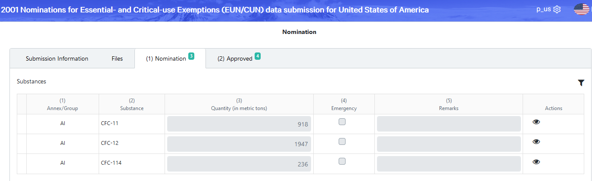
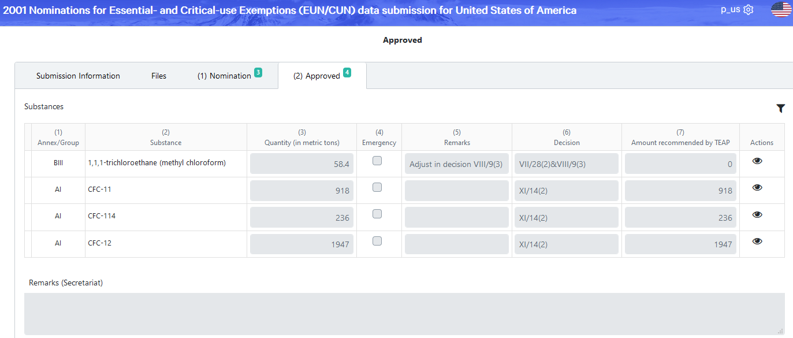
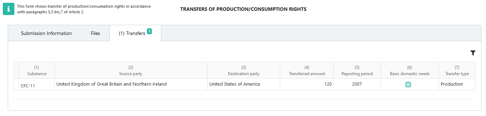

.. _procagents:

*********************
Other reporting forms
*********************

.. index:: Process agents, EUN, CUN, Transfer

Introduction
------------

To report data other than Article 7 and RAF (Accounting for essential and critical uses), choose the corresponding obligation from the list (see :ref:`List of reporting obligations`), fill-in the :guilabel:`Submission Information` tab and upload the supporting documentation in the :guilabel:`Files` tab, as explained in the general :ref:`Data entry forms` chapter, then :guilabel:`Save` and :guilabel:`Submit`.

You don't have to enter structured data in these forms. The secretariat will process the data reported (as uploaded files) and, once finished, you will be able to view the processed results in the additional tabs, as described below.

Nominations for Essential- and Critical-use Exemptions (EUN/CUN)
----------------------------------------------------------------

The same web form can be used to submit requests for essential use exemptions and critical use of methyl bromide.
Once processed by the secretariat, the substances and amounts become visible in the :guilabel:`Nomination` tab:

After the approval during the Meeting of the Parties, the Secretariat will further record the approved/recommended amounts, which will be shown in the :guilabel:`Approved` tab of the data form:

Transfer of production/consumption rights
-----------------------------------------

Once processed by the Secretariat, submissions regarding transfer of production/consumption rights in accordance with paragraphs 5,5 bis and 7 of Article 2 are displayed in the :guilabel:`Transfers` tab, showing the substance, source and destination parties, transferred amount, reporting period and whether it represents a transfer for basic domestic needs of Article 5 parties:

