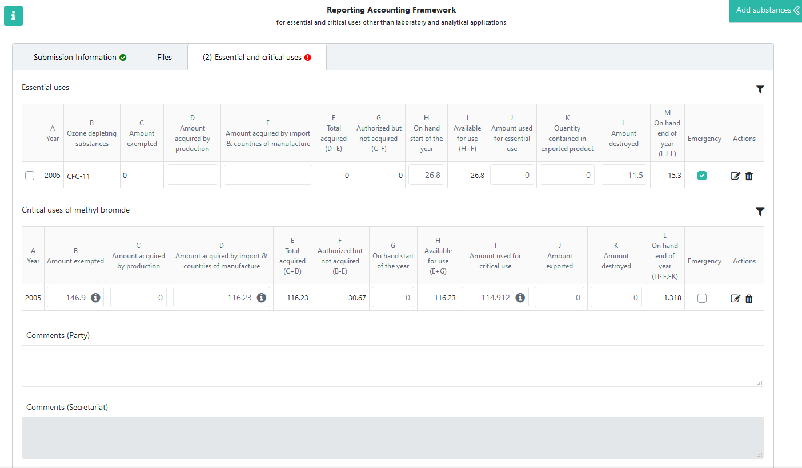
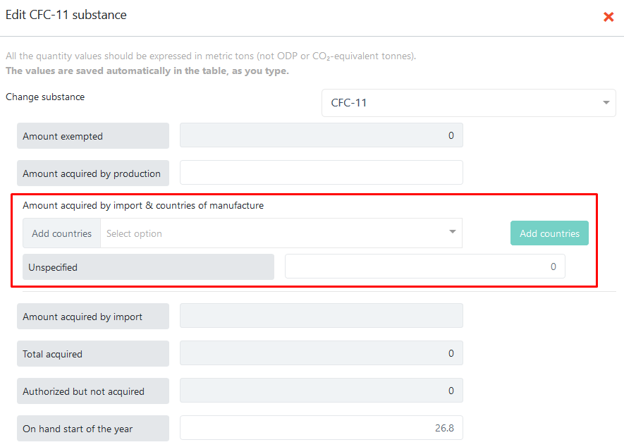
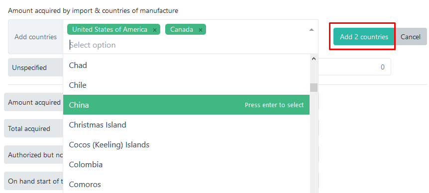
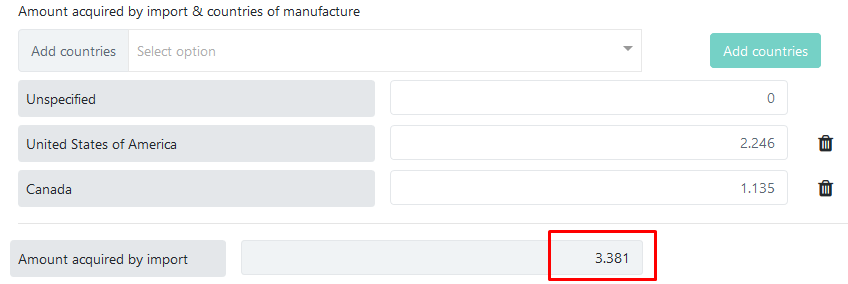
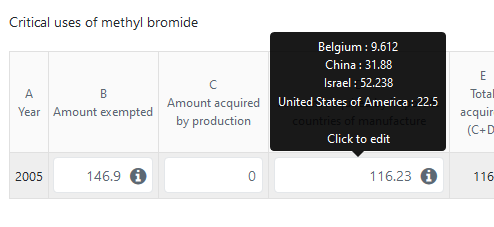
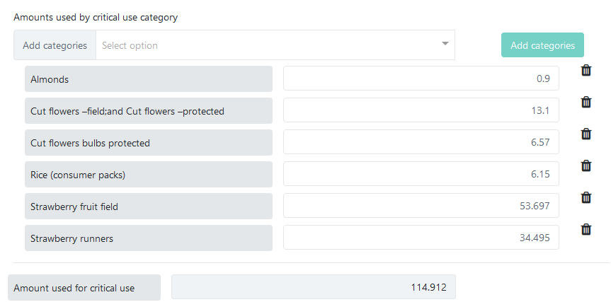
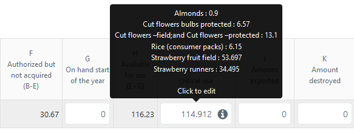
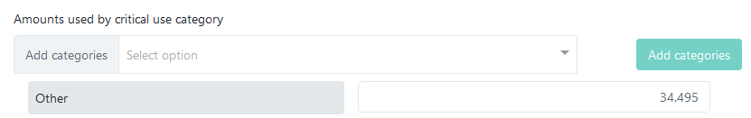
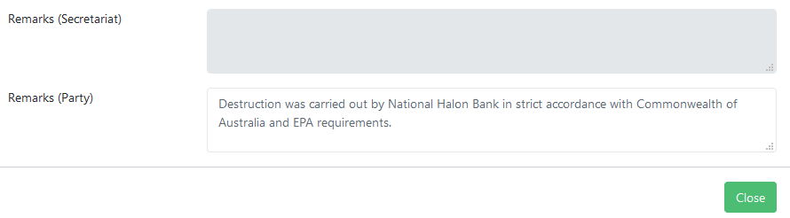

.. _raf:

************************************************
Accounting for essential and critical uses (RAF)
************************************************

.. index:: RAF accounting framework

Introduction
------------

The RAF data forms have three main sections. :guilabel:`Submission Information` and :guilabel:`Files` are explained in the general :ref:`Data entry forms` chapter. The :guilabel:`Essential and critical uses` tab is described below.

.. hint::
  Each form has its own detailed instructions on data reporting, displayed when clicking on the |icon-info| icon in the upper-left area of the page.

.. |icon-info| image:: images/icon-info.png

Essential and critical uses
---------------------------

Substances can be added as described in the :ref:`Adding substances` chapter, except for mixtures, which should not reported using this form.
Depending on the selected substance (methyl bromide or other), it is added in the second (`Critical uses of methyl bromide`) or first (`Essential uses`) table, respectively. The name of the substance is only displayed in the first table (column B), while all rows in the second table refer to Methyl Bromide.

Reporters should report values in the following columns:

- Amount acquired by production (column D/C). This field must be entered by the reporter.
- Amount acquired by import (column E/D). This field must be entered by the reporter. It is possible to separate the reported amount by country of manufacture, as described below.
- Amount on hand start of the year (column H/G), to be entered by the reporter
- Amount used for essential/critical use (column J/I). For critical uses it is possible to specify the amounts used by each agreed critical-use category, as described below.
- Quantity contained in exported product (column K of essential uses table)
- Amount exported (column J in the critical uses table)
- Amount destroyed (column L/K)

The other columns are calculated automatically by the system:

- Year of essential/critical use (column A)
- Name of controlled substance (column B, present only in the first table)
- Amount exempted - automatically filled in based on the existing exemption (column C in the essential uses table and B in the critical uses table)
- Total amount acquired (column F/E)
- Amount authorized but not acquired (column G/F)
- Total amount available for use (column I/H)
- Amount on hand end of year (column M/K), to be carried forward as `on hand start of the year` for next year

.. attention::
  In case you have to report quantities consumed in response to an emergency event, not previously agreed/exempted, the corresponding amounts must be added as a separate row, even if the respective substance already exists in the table. The :guilabel:`Emergency` checkbox allows to differentiate between the two reported amounts and must be checked in case of emergencies.

Reporting imported amounts by country of manufacture
^^^^^^^^^^^^^^^^^^^^^^^^^^^^^^^^^^^^^^^^^^^^^^^^^^^^
To enter the amount acquired by import and, optionally, contries of manufacture, click on column E (for essential uses) or column D (critical uses) to show the full data-entry form:

All editable fields from the main table can also be edited in this popup and the entered values will be automatically reflected in the table.
If you choose not to report imported amounts by country of manufacture, enter the total value in the `Unspecified` row. Otherwise, select one or more countries from the list and press the :guilabel:`Add X countries` button:

You can leave the default value (0) in the `Unspecified` row and simply enter amounts for each country. The total imported amount for all countries will be calculated automatically and displayed in the field below:

To correct a country added by accident, you can use the |icon-delete-small| button to remove the row and then add the correct countries.

Once entered, the individual amounts per country will be displayed in the main table, as a tooltip, when the mouse is placed over the corresponding column:

Reporting amounts by agreed critical-use category
^^^^^^^^^^^^^^^^^^^^^^^^^^^^^^^^^^^^^^^^^^^^^^^^^

Consumed amounts of methyl bromide by agreed critical-use categories can be reported in a similar manner, from the same popup screen. Above the :guilabel:`Amount used for critical use` field there is a section for selecting critical-use categories and entering individual amounts:

The list of critical-use categories is maintained by the Secretariat based on pre-existing critical use exemptions approved by Meetings of the Parties.

Just like for imports, the categories and corresponding amounts are shown in the tooltip, while the total amount used for critical use is calculated automatically and displayed in the main table:

If you choose not to report amounts for each agreed category, you can simply enter the total amount in the :guilabel:`Other` field, displayed right under the list of categories:

Entering remarks
----------------

It is also possible to enter remarks using the free-text field at the bottom of the data entry popup described above:

Other actions specific to RAF data reporting
--------------------------------------------

:guilabel:`Export as PDF`
  Any submission can be exported in PDF format for archiving or printing by pressing the :guilabel:`Export as PDF` button.
  This action is available before or after submitting a data report. It will always contain the information already saved on the server,
  so it is recommended to save the form before exporting the PDF document.

.. index:: Versions

:guilabel:`Versions`
  The :guilabel:`Versions` button shows a table with all versions of a submission (for the same party and reporting period),
  together with their metadata, such as author, last modification date and current state. An older version can be opened by pressing the 
  :guilabel:`View` button in the `Actions` column:

  For more information, please see the explanations of the :ref:`Revise <Revise>` function.

Submission workflow
-------------------

.. _Submit:

.. index:: Submit (RAF)

:guilabel:`Submit`
  Once the data entry phase is done and there are no validation |icon-caution| errors, you can `Submit` your report for processing by the Secretariat.

  You will be asked to confirm the submission. Please review carefully the messages in the popup dialog, as they may contain relevant information, 
  depending on the entered data.
  After submitting, you will only be able to change the reported data by using the :ref:`Recall <Recall>` or :ref:`Revise <Revise>` functions.
  The same functionalities as for Article 7 reporting are applicable, as explained in the :ref:`corresponding chapter <Art7Workflow>`

.. |icon-caution| image:: images/icon-caution.png

